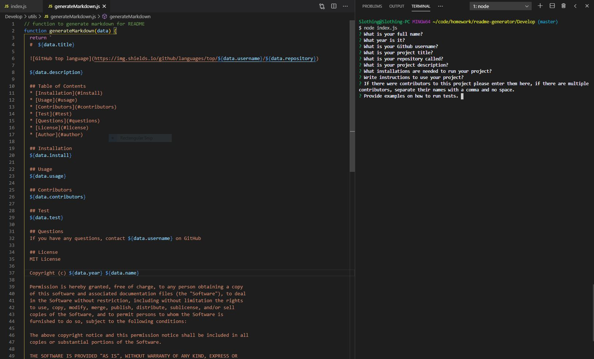

# README Generator

This is a command-line application that dynamically generates a professional README.md from a user's input. 

[README Generator](https://drive.google.com/file/d/1TNf6tot9HryqUInftu65i-4acMOm0ygH/view?usp=sharing) tutorial video is hosted on Google Drive

This application was authored by [Seth Martineau](https://github.com/slothings)